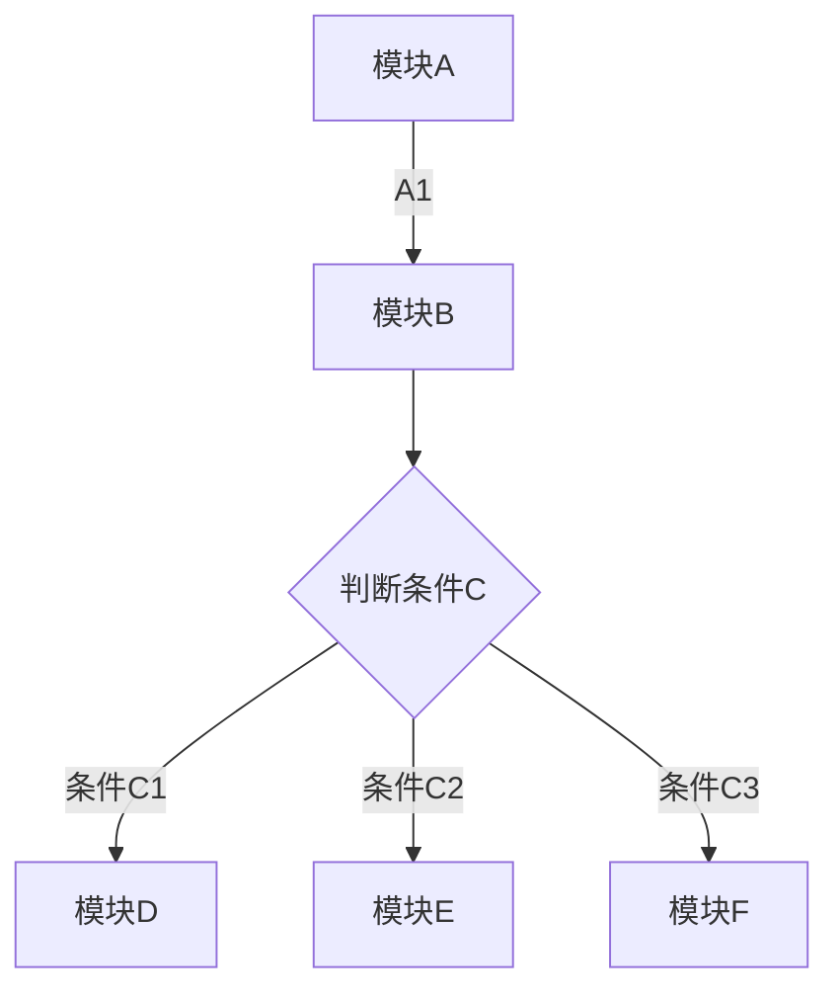

# 起因
偶尔会写一些思维导图、流程图或者项目架构，所以学习了一下markdown用mermaid怎么写，并且将这个记录了下来。

# 正文
## 构架图
### 语法
graph TD
A[模块A]-->|A1| B[模块B]
B --> C{判断条件C}
<!-- more -->
C -->|条件C1| D[模块D]
C -->|条件C2| E[模块E]
C -->|条件C3| F[模块F]

### 效果

## 流程图
### 语法
graph LR
    绘图 --> 导出图像
    导出图像 --> 上传服务器
    上传服务器 --> 文章插入

### 效果
